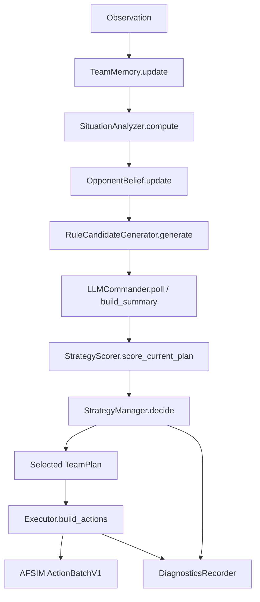

# Baiyang Team Agent 说明

本文档说明 `examples/rules/` 下 Baiyang Team Agent 的当前实现。文件请保持 UTF-8 编码。

## 1. 项目定位

Baiyang Agent 是一个用于 2v2 空战的团队决策 Agent，入口为：

- `baiyang_rule_agent.json`
- `baiyang_rule.py`
- `BaiyangRuleAgent`

核心原则：

- LLM 不直接输出 `set_flight`、`fire`、`co_fire`。
- LLM 只生成高层 `TeamPlan` 候选。
- 飞行和开火动作由本地 `Executor` 执行。
- LLM 失败、超时、网络不可用时，规则候选、评分器和策略管理器仍可独立运行。
- 当前参数都是本地规划近似参数，不是真实飞机或武器性能参数。

## 2. 整体逻辑链路

每步 `act()` 的主要顺序在 `baiyang_rule.py` 中：



关键输入输出：

- `TeamMemory.update()` 输出 `MemorySnapshot`。
- `SituationAnalyzer.compute()` 输出 `SituationFrame`。
- `OpponentBelief.update()` 输出 `BeliefState`。
- `RuleCandidateGenerator.generate()` 输出本地 `TeamPlan` 候选。
- `LLMCommander.poll()` 输出 `LLMGenerationResult`，只有 `READY` 且未过期的候选才可能进评分池。
- `StrategyScorer` 对当前计划每步评分；完整候选评分只在 `FULL_REPLAN` 时发生。
- `StrategyManager` 决定 `CONTINUE`、`LOCAL_REPAIR`、`FULL_REPLAN` 或 `EMERGENCY`。
- `Executor` 将最终 `TeamPlan` 转为 `ActionBatchV1`。

## 3. 核心模块

### TeamMemory

文件：`team_memory.py`

职责：

- 保存最近 `HISTORY_WINDOW_S = 20.0` 秒己方状态历史。
- 保存融合敌方航迹历史。
- 保存 `observation.events` 历史。
- 区分航迹状态：
  - `OBSERVED`：当前真实观测存在。
  - `COASTING`：短时不可见，使用上一状态外推。
  - `LOST`：超过 `TRACK_COASTING_TIMEOUT_S`。
- COASTING 用于动作连续性，不作为新的贝叶斯观测证据。

### SituationAnalyzer

文件：`situation.py`

职责：

- 计算敌我三维距离、水平距离、高度差。
- 计算相对速度、闭合速度、方位角、航向对准程度。
- 计算己方/敌方双机间距、航向差、高度差。
- 计算双方编队重心、重心距离和闭合速度。
- 计算敌方前后深度差、转向率、趋势项。
- 缺失指标用 `None`，不伪造第二架敌机。

### OpponentBelief

文件：`opponent_belief.py`，参数：`belief_params.json`

职责：

- 使用七个隐藏状态的离散 HMM 贝叶斯过滤：
  - `FOCUS_BLUE_1`
  - `FOCUS_BLUE_2`
  - `SPLIT_ATTACK`
  - `BRACKET`
  - `ATTACK_SUPPORT`
  - `BAIT_COUNTER`
  - `DISENGAGE`
- `UNKNOWN` 只作为 report label，不进入 posterior。
- 使用 log likelihood 和 log-sum-exp 归一化。
- 当前 belief 参与触发、评分假设概率和诊断。

### RuleCandidateGenerator

文件：`strategy.py`

职责：

- 生成本地高层 `TeamPlan` 候选。
- 候选必须通过 `validate_plan()`。
- 目标来自当前 Observation / TeamMemory，不硬编码飞机 ID。
- 非 aircraft 航迹会被过滤，避免把导弹航迹当战术目标。

### LLMCommander

文件：`llm_commander.py`，参数：`llm_params.json`

职责：

- 构造战术摘要。
- 异步请求 OpenAI-compatible LLM。
- 解析 LLM JSON 候选，转换为 `source=PlanSource.LLM` 的 `TeamPlan`。
- 管理状态：
  - `DISABLED`
  - `IDLE`
  - `PENDING`
  - `READY`
  - `FAILED`
  - `TIMEOUT`
  - `STALE`
- 支持 `consume_ready_result()` 和 `discard_ready_result()`。
- 支持失败退避：`retry_backoff_initial_steps`、`retry_backoff_multiplier`、`retry_backoff_max_steps`。

### StrategyScorer

文件：`strategy_scorer.py`，参数：`scorer_params.json`

职责：

- 使用 `Executor.preview_flight_guidance()` 复用真实执行的战术航向/高度/Mach 含义。
- 对七个 belief hypothesis 进行轻量 rollout。
- 估计 fire-window、pending shot、prelaunch threat chain。
- 计算分项效用、expected utility、worst-case utility、switch cost。
- 评分是轻量近似，不是完整导弹动力学或 AFSIM 替代品。

### StrategyManager

文件：`strategy_manager.py`，参数：`strategy_manager_params.json`

职责：

- 维护当前计划、计划开始 step、最小保持时间、leader streak。
- 处理触发：
  - 普通 review。
  - belief 变化。
  - 当前计划失效。
  - 目标 LOST。
  - 己方/敌方集合变化。
  - 高风险强事件。
- 在 `FULL_REPLAN` 时合并规则候选和有效 LLM 候选。
- 通过本地评分和切换门禁选择最终计划。
- LLM 不能绕过评分器和门禁。

### Executor

文件：`executor.py`

职责：

- 将 `TeamPlan` 转为每架存活己机最多一个 `set_flight` 和一个武器动作。
- direct fire 条件：
  - 目标 `OBSERVED`
  - shooter 在 `target.detected_by`
  - `aam_medium` enabled 且数量 > 0
  - 距离 <= `FIRE_RANGE_M`
  - 冷却 > `FIRE_COOLDOWN_S`
- co_fire 条件：
  - 目标 `OBSERVED`
  - shooter 有弹
  - 其他受控存活己机探测到目标
  - guider 按 `controlled_platform_ids` 稳定顺序选择
- COASTING 目标不允许开火。

### Diagnostics

文件：`diagnostics.py`，参数：`diagnostics_params.json`

职责：

- 记录每步 `DecisionTrace`。
- 默认只保留内存环形缓冲。
- 设置 `BAIYANG_DIAGNOSTICS_DIR` 后写 JSONL。
- 不记录 API Key、Authorization header 或完整 LLM 原始响应。

### Runtime Validation

文件：`runtime_validation.py`

职责：

- `reset()` 时校验 `config.py` 和所有参数 JSON。
- 配置错误会抛出异常，避免带错误配置进入对局。

## 4. 高层战术

当前 `Tactic`：

### FOCUS_FIRE

- 两机或 lead-support 共同压制同一主要目标。
- 适合目标明确、需要快速建立杀伤链时。
- 局限：若第二敌机威胁较高，可能产生无人压制风险。

### SEPARATE_ATTACK

- 两架己机优先分配不同目标。
- 适合敌方双机都构成威胁，或需要避免被局部二打一时。
- 当前 2v2 固定场景中，阶段五A 后常在风险处理后转入该策略。

### MUTUAL_SUPPORT

- 双机不是 `SUPPORTER + SUPPORTER`。
- 动态分配 `PRESSER` 和 `SUPPORTER`。
- `SUPPORTER` 优先覆盖未被压制敌机，或保持侧翼/支援位置。
- 局限：支援动作仍是规则近似，未建模复杂空战协同。

### BRACKET

- 双机围绕目标或敌方编队重心做左右不同侧向偏置。
- 保持两机偏置符号不同。
- 若存在高威胁目标，受威胁飞机会优先防御。
- 局限：没有完整包线/能量管理模型。

### DEFEND_COUNTER

- 一机 `DEFENDER`，另一机 `PRESSER`。
- DEFENDER 远离或侧切主要威胁。
- PRESSER 压制对 DEFENDER 威胁最高的敌机。
- 局限：当前 DEFENDER 可能转向较深，后续恢复进攻需要时间。

### DISENGAGE

- 远离最近真实威胁，保持安全巡航。
- 作为无目标或 fallback 候选。
- 不应被理解为“胜利策略”，只是安全保持/脱离。

平等双机模式 `PEER` 不代表没有角色；角色是临时的，并可在下一次生成计划时交换。

## 5. 动态策略切换

`StrategyManager` 使用双时间尺度：

- 每步执行：memory、situation、belief、current plan score、威胁检查、当前计划执行。
- 只有 FULL_REPLAN 时完整评分全部候选。

普通切换门禁：

- 已超过 `minimum_hold_steps`。
- 新计划合法。
- 满足绝对优势或相对优势：
  - `switch_absolute_advantage`
  - `switch_relative_advantage`
- 同一语义 leader 连续领先 `leader_required_reviews` 次。
- worst-case 不恶化超过 `worst_case_degradation_limit`。
- `leader_identity_mode=semantic` 时使用 tactic、roles、targets、关键 metadata 生成稳定 key。

强事件会降低门槛，但不会无条件采用候选：

- `new_llm_ready`
- `stable_belief_shift`
- `enemy_split_threat`
- `enemy_fire_window_high`
- `unpressed_enemy_high_risk`
- `current_score_degrading`
- `current_target_lost_or_destroyed`
- `ownship_destroyed`
- `current_plan_invalid`

硬触发：

- 当前计划非法。
- 主要目标 LOST。
- 己方飞机集合变化。
- 首次发现真实敌机。

## 6. 评分逻辑

主要评分项：

- `attack_opportunity`：分配目标距离变化、对准、观测、弹药。
- `own_fire_opportunity`：己方未来 fire-window 估计。
- `survivability`：敌方接近、对准、多机威胁。
- `coordination`：双机间距、角色/目标是否符合 tactic。
- `counter_effect`：相对保持当前航向参考轨迹的几何改善。
- `local_advantage`：局部二打一/被二打一几何。
- `bracket_risk`：敌方从不同方位夹击风险。
- `unpressed_enemy_risk`：无人压制敌机风险。
- `enemy_fire_window_risk`：敌方进入或接近发射窗口风险。
- `ammo_waste` / `duplicate_attack_waste`：弹药和重复攻击浪费。
- `terminal_survival` / `exchange_value`：轻量终局存活和交换价值。
- `switch_cost`：相对当前计划的切换成本。

注意：

- `_fire_window_estimate()` 是评分近似，考虑距离、closing、alignment、观测和弹药。
- Executor 真实开火是硬条件：`OBSERVED`、`detected_by`、弹药、50km、冷却。
- `pending_shot` 和 `prelaunch threat chain` 不是完整导弹模型。

## 7. LLM 配置与容错

LLM 输入摘要包括：

- step、sim_time。
- 己方平台、位置、高度、速度、航向、弹药。
- OBSERVED/COASTING 敌方航迹和 `detected_by`。
- SituationFrame 的距离、闭合、对准、编队结构。
- Belief posterior、label、entropy。
- 当前计划、评分、规则候选摘要。
- 允许的 `StrategyMode`、`Role`、`Tactic`。

LLM 输出必须是唯一 JSON 对象：

```json
{
  "candidates": [
    {
      "mode": "PEER",
      "tactic": "FOCUS_FIRE",
      "primary_target": "真实目标ID或null",
      "roles": {
        "真实己机ID": "SHOOTER"
      },
      "target_assignments": {
        "真实己机ID": "真实目标ID或null"
      },
      "valid_for_steps": 6,
      "rationale": ["简短理由"]
    }
  ]
}
```

当前实现读取 `llm_params.json` 中的：

- `enabled`
- `provider`
- `base_url`
- `model`
- `api_key`
- `request_timeout_s`
- `connect_timeout_s`
- `max_candidates`
- `stale_after_steps`
- `llm_ready_max_age_steps`
- retry backoff 参数

不要把真实 API Key 提交到 Git。可在本地临时填写 `api_key`，或后续改回环境变量读取。

生命周期：

- `submit()` 后立即返回，不阻塞 act。
- `PENDING` 期间不重复提交。
- `READY` 结果只在进入一次评分池后 consume。
- 全部非法、全部 dedupe、过期、目标失效会 discard。
- 失败/超时会进入结构化错误和退避，不影响规则链路。

## 8. 运行命令

以下命令在项目根目录执行。

安装/同步依赖：

```powershell
uv sync
```

校验 Agent：

```powershell
uv run air-combat validate-agent examples/rules/baiyang_rule_agent.json
```

检查 AFSIM gRPC：

```powershell
uv run air-combat check-afsim
```

Baiyang vs baseline 短 smoke：

```powershell
uv run air-combat run `
  --blue-agent examples/rules/baiyang_rule_agent.json `
  --red-agent examples/rules/a2a_rule_agent.json `
  --scenario configs/scenarios/aircraft_2v2.json `
  --step-delay 0 `
  --steps 180 `
  --seed 1
```

360 步固定 seed：

```powershell
uv run air-combat run `
  --blue-agent examples/rules/baiyang_rule_agent.json `
  --red-agent examples/rules/a2a_rule_agent.json `
  --scenario configs/scenarios/aircraft_2v2.json `
  --step-delay 0 `
  --steps 360 `
  --seed 1
```

500 步固定 seed：

```powershell
uv run air-combat run `
  --blue-agent examples/rules/baiyang_rule_agent.json `
  --red-agent examples/rules/a2a_rule_agent.json `
  --scenario configs/scenarios/aircraft_2v2.json `
  --step-delay 0 `
  --steps 500 `
  --seed 1
```

baseline vs baseline：

```powershell
uv run air-combat run `
  --blue-agent examples/rules/a2a_rule_agent.json `
  --red-agent examples/rules/a2a_rule_agent.json `
  --scenario configs/scenarios/aircraft_2v2.json `
  --step-delay 0 `
  --steps 500 `
  --seed 1
```

普通命令行写法：

```bash
uv run air-combat run --blue-agent examples/rules/baiyang_rule_agent.json --red-agent examples/rules/a2a_rule_agent.json --scenario configs/scenarios/aircraft_2v2.json --step-delay 0 --steps 500 --seed 1
```

输出：

- 框架 replay：`runs/*.jsonl`
- 诊断 JSONL：见下一节

## 9. 测试命令

LLM 生命周期：

```powershell
uv run python examples/rules/test_llm_lifecycle.py
```

战术语义：

```powershell
uv run python examples/rules/test_phase2_semantics.py
```

StrategyManager 门禁：

```powershell
uv run python examples/rules/test_phase3_manager.py
```

轻量交战评分：

```powershell
uv run python examples/rules/test_phase4_scorer.py
```

预发射威胁预测：

```powershell
uv run python examples/rules/test_phase5a_prelaunch.py
```

py_compile：

```powershell
uv run python -m py_compile `
  examples/rules/config.py `
  examples/rules/team_memory.py `
  examples/rules/situation.py `
  examples/rules/opponent_belief.py `
  examples/rules/strategy.py `
  examples/rules/executor.py `
  examples/rules/fallback.py `
  examples/rules/strategy_scorer.py `
  examples/rules/strategy_manager.py `
  examples/rules/diagnostics.py `
  examples/rules/runtime_validation.py `
  examples/rules/baiyang_rule.py
```

validate-agent：

```powershell
uv run air-combat validate-agent examples/rules/baiyang_rule_agent.json
```

## 10. 参数修改指南

### `llm_params.json`

重要参数：

- `enabled`：是否允许提交 LLM 请求。关闭后规则链路独立运行。
- `base_url` / `model` / `api_key`：OpenAI-compatible 接口配置。不要提交真实 key。
- `request_timeout_s`：HTTP 总超时。增大更容易等到慢响应，但结果可能过期。
- `connect_timeout_s`：当前配置字段存在，但默认 transport 主要使用 `request_timeout_s`。
- `max_candidates`：LLM 最多候选数。增大增加评分成本。
- `stale_after_steps`、`llm_ready_max_age_steps`：结果过期步数。增大可保留慢响应，减小可避免旧态势候选参与。
- `retry_backoff_initial_steps`、`retry_backoff_multiplier`、`retry_backoff_max_steps`：失败退避。增大可降低失败重试频率。

### `strategy_manager_params.json`

重要参数：

- `review_interval_steps`：普通复核间隔。减小会更频繁评分，耗时增加。
- `minimum_hold_steps`：最短计划保持。增大减少抖动，但响应变慢。
- `switch_absolute_advantage`：绝对分数优势门槛。减小更易切换。
- `switch_relative_advantage`：相对分数优势门槛。减小更易切换。
- `leader_required_reviews`：连续领先次数。增大更稳，减小更灵敏。
- `strong_event_threshold_multiplier`：强事件下门槛折扣。越小越容易因强事件切换。
- `enemy_fire_window_enter_threshold` / `exit_threshold`：敌方 fire-window 强事件进入/退出阈值。
- `unpressed_enemy_enter_threshold` / `exit_threshold`：无人压制风险强事件阈值。
- `risk_event_cooldown_steps`：风险强事件冷却，防止每步重复触发。

### `scorer_params.json`

重要参数：

- `prediction.horizon_s`：基础 rollout 视野。
- `fire_window.threat_prediction_horizon_s`：预发射风险视野。增大更早感知风险，但耗时增加。
- `fire_window.predicted_launch_probability_threshold`：预测发射链记录阈值。减小更敏感。
- `fire_window.prelaunch_hit_probability_scale`：预发射风险折算命中风险比例。增大会更保守。
- `fire_window.time_to_fire_discount`：越大，远期风险衰减越慢。
- `utility_weights.unpressed_enemy_risk`：无人压制风险权重。增大更偏分兵/覆盖。
- `utility_weights.enemy_fire_window_risk`：敌方发射窗口风险权重。增大更早避险。
- `utility_weights.terminal_survival`、`exchange_value`：终局存活和交换价值权重。增大更重视最终存活。

### `belief_params.json`

重要参数：

- `initial_prior`：七状态初始先验。
- `transition_matrix`：状态持续性和转移概率。
- `feature_groups`：观测特征组均值、协方差、scale。
- `min_report_probability`、`max_report_entropy`：report label 是否显示 UNKNOWN 的门槛。

不要随意改维度；`runtime_validation.py` 会严格校验。

### `diagnostics_params.json`

重要参数：

- `memory_history_size`：内存保留 trace 数。
- `flush_every_steps`：写文件 flush 间隔。
- `record_candidate_breakdown`：是否记录候选 breakdown。
- `max_candidates_logged`：诊断中最多记录候选数。

### 常见调参目标

更积极进攻：

- 降低 `switch_absolute_advantage` / `switch_relative_advantage`。
- 降低风险类权重，或提高 `attack_opportunity`、`own_fire_opportunity` 权重。
- 谨慎降低 `minimum_hold_steps`。

更早避险：

- 提高 `enemy_fire_window_risk`、`unpressed_enemy_risk`、`terminal_survival` 权重。
- 降低 `enemy_fire_window_enter_threshold`。
- 增大 `threat_prediction_horizon_s`。

减少策略切换：

- 增大 `leader_required_reviews`。
- 增大 `minimum_hold_steps`。
- 增大 `switch_absolute_advantage` / `switch_relative_advantage`。

降低推演耗时：

- 降低 `threat_prediction_horizon_s`。
- 降低 `max_candidates`。
- 提高 review 间隔。
- 减少诊断候选详情。

降低 LLM 调用频率：

- 增大 retry backoff。
- 增大 `llm_wait_max_steps`。
- 保持 `enabled=false`，或只在需要时开启。

不要同时大幅修改风险权重、切换门槛和 rollout 视野，否则很难定位效果来源。

## 11. 诊断日志说明

启用诊断：

```powershell
$env:BAIYANG_DIAGNOSTICS_DIR = "outputs\\baiyang_debug"
```

运行后会生成：

```text
outputs/baiyang_debug/<episode_id>.jsonl
```

关键字段：

- `current_plan_before`、`selected_plan`、`plan_source`
- `belief_posterior`、`belief_report_label`、`belief_entropy`
- `llm_request_count`、`llm_response_count`、`llm_consumed_count`
- `llm_discarded_count`、`llm_discard_reasons`
- `candidate_audit`
- `switch_gate`
- `current_plan_score`、`selected_plan_score`
- `actions_summary`
- `module_timings_ms`、`total_act_ms`
- `fallback_reason`、`errors`

判断 LLM 是否参与评分：

- 看 `llm_response_count > 0`。
- 看 `candidate_audit` 中是否有 `source: "LLM"`。
- 看 LLM 候选是否 `scored=true`、是否有 rank。
- 看 `llm_consumed_count` 是否增加。

判断为什么没有切换：

- 看 `switch_gate.reject_reasons`。
- 常见原因：
  - `score advantage below threshold`
  - `leader streak below required reviews`
  - `minimum hold active`
  - `worst case degradation too large`

判断是否切换过晚：

- 对比 `candidate_audit.rank=1` 首次出现 step。
- 对比 `switch_gate.gate_passed=true` step。
- 对比实际 `selected_plan.plan_id` 改变 step。
- 对比 `actions_summary` 中 fire step 和 replay 里的毁伤 step。

判断同一 LLM 响应是否重复使用：

- 同一 `llm_request_id` 不应在多次 FULL_REPLAN 中重复进入评分池。
- READY 被使用后应看到 `llm_consumed=true` 或 discard reason。

判断哪个评分项导致候选胜出：

- 看 `candidate_audit[].utility_breakdown`。
- 重点比较：
  - `own_fire_opportunity`
  - `enemy_fire_window_risk`
  - `unpressed_enemy_risk`
  - `terminal_survival`
  - `exchange_value`
  - `switch_cost`

## 12. 当前效果和限制

已验证结果：

- 固定 2v2 场景 `configs/scenarios/aircraft_2v2.json` 下，Baiyang vs baseline 在 seed 1-5、500 步上限评测中稳定 `blue win / red_eliminated`。
- baseline vs baseline 在 seed 1-5 下为 `draw / simultaneous_elimination`。
- 360 步可能在导弹命中确认前截断；500 步能看到完整战果。

当前限制：

- 场景和 seed 高度确定，尚未充分验证不同初始几何。
- pending shot 和 fire-window 是轻量近似，不是完整导弹模型。
- `DEFEND_COUNTER` 可能让 DEFENDER 转向较深，恢复进攻需要时间。
- FULL_REPLAN 峰值耗时较高，主要来自多候选、多 hypothesis、30 秒 threat rollout。
- 真实 LLM 网络可能受本机权限、代理、服务商接口影响。
- 当前代码读取 `api_key` 字段，真实 key 不应进入提交。

## 13. 推荐开发流程

1. 只修改单一模块或单一参数组。
2. 运行对应测试。
3. 运行 `py_compile`。
4. 运行 `validate-agent`。
5. 跑短 smoke。
6. 跑 500 步固定 seed。
7. 对比诊断 JSONL。
8. 确认无违规、无 timeout、无 fallback 异常后再提交 Git。

推荐最小回归命令：

```powershell
uv run python examples/rules/test_llm_lifecycle.py
uv run python examples/rules/test_phase2_semantics.py
uv run python examples/rules/test_phase3_manager.py
uv run python examples/rules/test_phase4_scorer.py
uv run python examples/rules/test_phase5a_prelaunch.py
uv run air-combat validate-agent examples/rules/baiyang_rule_agent.json
```
